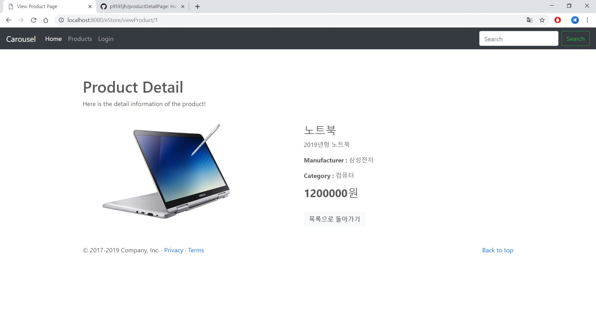

# Product Detail Page 
## 한성대학교 정보시스템공학과 1494054 박재훈 - 웹 프레임워크2 과제1 

고객이 Product 조회 페이지에서 제품 상세 정보를 볼 수 있는 웹 애플리케이션입니다.  
info 버튼을 누르면 '/viewProduct/해당 제품의 id값' 페이지로 연결되며, 컨트롤러에서 그 id값을 받아서 제품의 정보를 불러와 viewProduct.jsp에 뿌려주는 방식입니다.   
viewProduct에서는 부트스트랩의 grid를 이용하여 이미지와 정보가 각각 반씩 차지하는 화면을 생성합니다.  

기존 Product 페이지에서 info 버튼을 추가하였습니다.  

노트북을 조회한 화면입니다.  
 

아이폰을 조회한 화면입니다.  
이와 같이 제품을 조회할 수 있습니다.  
